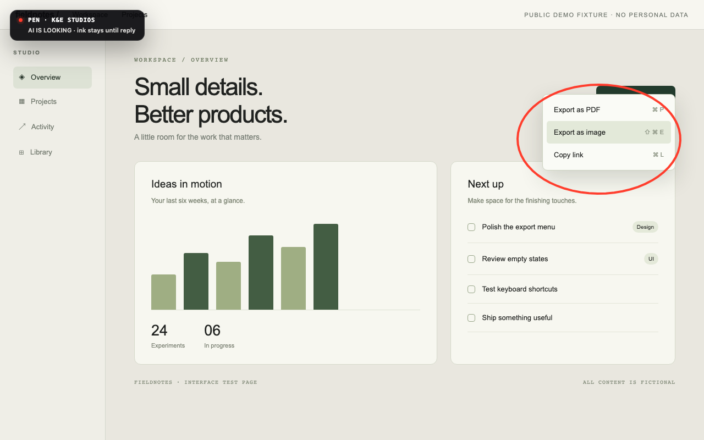

# KE Pen

Less explaining. More pointing.

New in 0.6.0: hold the middle mouse button to freeze fleeting menus and capture a region (macOS and Windows).

The whole KE Pen is completely free and open source—there is no limited
edition, paid tier, or feature gate. This Space documents the applied system
and links to downloads for macOS, Windows, and Linux. KE Pen runs locally on
your computer; the Space is not a browser clone and does not receive screen
images.

- [Download KE Pen for macOS, Windows, or Linux](https://github.com/willykeenan/pen/releases/tag/v0.6.0)
- [Source and release evidence](https://github.com/willykeenan/pen)
- [Applied-system card](https://github.com/willykeenan/pen/blob/main/SYSTEM_CARD.md)

Created by William Keenan at K&E Studios. MIT licensed.
